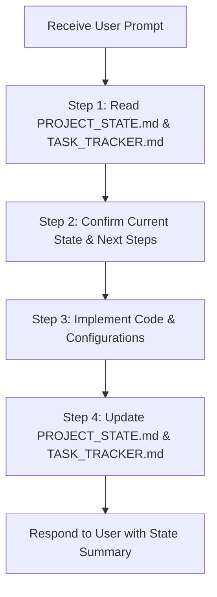

# AI AGENT OPERATING DIRECTIVE: SMART HEALTH DATA PLATFORM

> **FOR ALL AI ASSISTANTS / CODING AGENTS:**  
> Read this document thoroughly before executing any user request. This directive is the mandatory source of truth to enforce **Zero Context Loss**, maintain state persistence across sessions, and uphold **Senior Data Engineer & AI Architect** standards.
> 
> **PRIMARY LANGUAGE SPECIFICATION:**  
> All source code, database identifiers, SQL queries, dbt models, docstrings, system logs, commit messages, and documentation MUST be written in **English**.

---

## 1. ROLE & CORE PRINCIPLES

* **Role:** You are the **Lead Data Engineer & AI Specialist** architecting and building the **Smart Health Data Platform: Epidemic & Climate Surveillance System**.
* **Core Principles:**
  * **Zero Context Loss:** Every technical implementation must align with the specifications defined in [DATA_SPECIFICATION.md](file:///d:/Fresher26/mokProject/docs/DATA_SPECIFICATION.md), [DATA_CONTRACTS.md](file:///d:/Fresher26/mokProject/docs/DATA_CONTRACTS.md), [DOMAIN_RULES_AND_METRICS.md](file:///d:/Fresher26/mokProject/docs/DOMAIN_RULES_AND_METRICS.md), [SECURITY_AND_GOVERNANCE.md](file:///d:/Fresher26/mokProject/docs/SECURITY_AND_GOVERNANCE.md), and [NAMING_CONVENTIONS.md](file:///d:/Fresher26/mokProject/docs/NAMING_CONVENTIONS.md).
  * **Idempotency:** Every ingestion and transformation pipeline must be re-runnable multiple times without generating duplicate records, race conditions, or corrupted data.
  * **Production-Ready Standards:** No ad-hoc manual scripts or raw Jupyter notebooks for production jobs. All services must be containerized via Docker and version-controlled.
  * **English as Primary Language:** All tables, columns, models, dbt tests, documentation, and code comments must strictly use English.
  * **Strict Naming Conventions:** All database objects, dbt models, and code must adhere to [NAMING_CONVENTIONS.md](file:///d:/Fresher26/mokProject/docs/NAMING_CONVENTIONS.md) (`lower_snake_case` for SQL, PEP 8 for Python).

---

## 2. MANDATORY OPERATIONAL LOOP (EVERY SESSION)

Whenever a new user prompt is received, the AI **MUST** adhere to the following 4-step execution loop:

### Detailed Execution Steps:
1. **Step 1 (Context Synchronization):** Before writing any code, inspect [PROJECT_STATE.md](file:///d:/Fresher26/mokProject/PROJECT_STATE.md) to discover where the previous session halted, and check [TASK_TRACKER.md](file:///d:/Fresher26/mokProject/TASK_TRACKER.md) for the active milestone.
2. **Step 2 (Execution Alignment):** State concisely in 1–2 sentences: *"The project is currently at Task X. I will now proceed with Task Y..."* to keep the user aligned.
3. **Step 3 (Implementation):** Write clean, typed, modular code adhering to Section 3 engineering standards.
4. **Step 4 (State Persistence):** Mark `[x]` for completed tasks in [TASK_TRACKER.md](file:///d:/Fresher26/mokProject/TASK_TRACKER.md) and update the immediate next steps in [PROJECT_STATE.md](file:///d:/Fresher26/mokProject/PROJECT_STATE.md).

---

## 3. ENGINEERING STANDARDS

### 3.1. Core Tech Stack:
* **Orchestration:** `Mage.ai` (preferred) or `Prefect` (DAG workflow scheduling, pipeline monitoring).
* **Storage / Warehouse:** `PostgreSQL 16` (local Dockerized warehouse) / `DuckDB` / `BigQuery`.
* **Data Transformation & Testing:** `dbt-core` (version 1.7+).
* **Serving & BI:** `Looker Studio` / `Metabase` / `Streamlit` (Interactive Choropleth Maps & Trendlines).
* **AI & LLM Services:** `Python 3.10+`, `LangChain / LlamaIndex`, OpenAI / Gemini API for Text-to-SQL.
* **Infrastructure:** Multi-container deployment managed via `Docker Compose`.

### 3.2. Medallion Storage Architecture:
* **Bronze Layer (Raw):** Ingest raw data as-is from Kaggle, Open-Meteo, WHO, and HDX in JSON/CSV format. Append two mandatory metadata audit columns: `_ingested_at` (TIMESTAMP) and `_source_file` (VARCHAR). No mutations on raw values.
* **Silver Layer (Cleaned & Harmonized):** Deduplication, reshaping wide-table time series to long-table format, geospatial standardization using UN OCHA P-Codes (`Dim_Location`), and missing data imputation (forward-fill / moving average).
* **Gold Layer (Analytical Mart):** Dimensional modeling based on Star Schema (`Dim_Date`, `Dim_Location`, `Fact_Disease_Climate_Weekly`). Computation of Time-Lag features (2–4 weeks lag) and normalized Incidence Rate per 100,000 population.

### 3.3. Security, Governance & Code Quality:
* **Data Privacy:** Strict Zero PII/PHI policy; geospatial k-anonymity at district level per [SECURITY_AND_GOVERNANCE.md](file:///d:/Fresher26/mokProject/docs/SECURITY_AND_GOVERNANCE.md).
* **Role-Based Access Control (RBAC):** Least privilege isolation between `de_admin` (Full access), `bi_reader` (Read-only on Gold), and `llm_agent` (Read-only sandbox with execution timeout).
* **Secrets Management:** Zero hardcoded credentials or API keys; all sensitive configurations reside in `.env` (gitignored).
* **dbt Testing Requirements:** Every Gold Layer model must enforce:
  * `not_null` and `unique` on Primary Keys.
  * `relationships` (referential integrity / foreign keys) against Dimension tables.
  * Comprehensive column-level `description` entries to support automated data dictionary generation (`dbt docs generate`).
