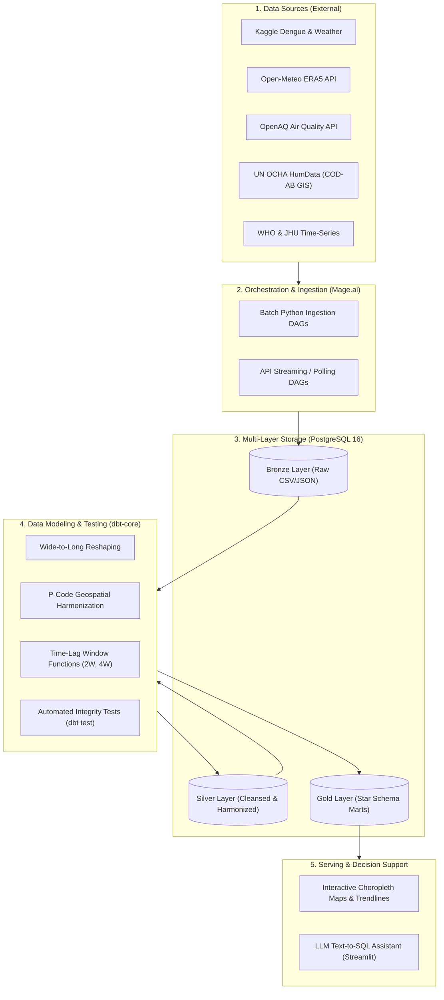

# Smart Health Data Platform: Epidemic & Climate Surveillance System

[](https://www.postgresql.org/)
[](https://www.mage.ai/)
[](https://www.getdbt.com/)
[](https://streamlit.io/)
[](https://www.docker.com/)
[](https://opensource.org/licenses/MIT)

> An end-to-end, production-grade **Data Engineering & AI Surveillance Platform** integrating epidemiological health surveillance with meteorological and air-quality indicators. The system enables public health authorities to transition from **reactive response** to **proactive prediction** by leveraging multi-week time-lag analysis and population-normalized risk modeling.

---

## 🌟 Key Capabilities & Differentiators

* **Medallion Data Lakehouse Architecture:** Strict separation between Raw Ingestion (`Bronze`), Cleansed & Harmonized Datasets (`Silver`), and Analytical Star Schema Marts (`Gold`).
* **Epidemiological Time-Lag Feature Engineering:** Automated calculation of 2-week and 4-week rainfall and temperature lag features (`rainfall_lag_2w`, `rainfall_lag_4w`, `temp_lag_2w`) capturing the biological incubation cycle of the *Aedes* mosquito vector.
* **Population-Normalized Risk Metric:** Automated computation of **Incidence Rate per 100,000 population** to eliminate urban density distortion on Choropleth Heatmaps.
* **Automated Risk Stratification Matrix:** Real-time multi-factor classification categorizing administrative entities into `Severe`, `High`, `Moderate`, and `Low` risk alerts.
* **Conversational AI (Text-to-SQL):** Integrated LLM assistant enabling clinicians and public health officers to query surveillance datamarts using natural language.

---

## 🏗️ Architecture Blueprint



---

## 📂 Project Repository Structure

```text
smart-health-platform/
├── .agents/                        # AI operating directives & IDE workspace rules
│   └── rules/smart_health_protocol.md
├── docker/                         # Multi-container infrastructure definitions
│   └── docker-compose.yml          # PostgreSQL 16 + Mage.ai orchestrator
├── data/                           # Local data lake storage (Git ignored)
│   ├── bronze/                     # Raw ingested data (CSV, JSON, GeoJSON)
│   ├── silver/                     # Cleansed and harmonized files (Parquet)
│   └── gold/                       # Materialized datamart exports
├── pipelines/                      # Ingestion scripts & Mage.ai pipeline DAGs
│   ├── extract_kaggle_dengue.py
│   ├── extract_open_meteo.py
│   └── extract_un_ocha_boundaries.py
├── dbt_transforms/                 # dbt project for dimensional modeling
│   ├── models/
│   │   ├── staging/                # Staging views over Bronze
│   │   ├── intermediate/           # Cleaned Silver tables & P-Code mapping
│   │   └── marts/                  # Gold tables: Dim_Location, Dim_Date, Fact
│   ├── macros/                     # Reusable SQL functions (Time-lags, Epi-week)
│   └── tests/                      # Custom data quality tests
├── bi_dashboard/                   # Streamlit interactive application & BI configs
│   └── app.py                      # Choropleth maps & conversational AI UI
├── docs/                           # Comprehensive Specifications & Reference Architecture
│   ├── ROADMAP.md                  # Comprehensive 5-Sprint project roadmap & Gantt
│   ├── USE_CASES_AND_ACTORS.md     # Detailed user personas, 5 functional modules & use cases
│   ├── DATA_SPECIFICATION.md       # Data catalog, grain definitions & Star Schema
│   ├── DATA_CONTRACTS.md           # Strict column-level schemas (Bronze/Silver/Gold)
│   ├── DOMAIN_RULES_AND_METRICS.md # Epidemiological rules & risk matrix algorithm
│   ├── SECURITY_AND_GOVERNANCE.md  # Zero PII policy, RBAC roles, and LLM query sandboxing
│   ├── NAMING_CONVENTIONS.md       # lower_snake_case for SQL, dbt modeling & PEP 8 guide
│   └── PROMPT_TEMPLATES.md         # Standardized prompts for AI agent pair programming
├── AGENTS.md                       # Core AI Agent operating directives
├── TASK_TRACKER.md                 # Granular Sprint WBS with Definition of Done (DoD)
├── PROJECT_STATE.md                # Real-time state snapshot (Short-term RAM)
└── README.md                       # Executive project documentation (This file)
```

---

## 📖 System Specifications & Engineering Documentation

Before writing code or interacting with AI agents, consult the authoritative documentation suite:

| Document | Primary Focus & Role |
| :--- | :--- |
| ⚡ [PROJECT_STATE.md](file:///d:/Fresher26/mokProject/PROJECT_STATE.md) | **Live Memory Snapshot (Root):** Active sprint, current task, and immediate next 3 steps. |
| 🧠 [AGENTS.md](file:///d:/Fresher26/mokProject/AGENTS.md) | **AI Operating Directive (Root):** Zero Context Loss protocol, standards, and security mandates. |
| ✅ [TASK_TRACKER.md](file:///d:/Fresher26/mokProject/TASK_TRACKER.md) | **Execution Checklist (Root):** Granular micro-tasks and acceptance criteria. |
| 📋 [docs/ROADMAP.md](file:///d:/Fresher26/mokProject/docs/ROADMAP.md) | **5-Sprint Delivery Timeline:** Gantt chart, milestones, and cross-sprint dependencies. |
| 👥 [docs/USE_CASES_AND_ACTORS.md](file:///d:/Fresher26/mokProject/docs/USE_CASES_AND_ACTORS.md) | **Functional Scope:** 5 system personas, 5 core modules, and end-to-end operational use cases. |
| 📑 [docs/DATA_CONTRACTS.md](file:///d:/Fresher26/mokProject/docs/DATA_CONTRACTS.md) | **Schema Registry:** Mandatory column names, data types, and primary keys across Bronze, Silver, and Gold. |
| 🔬 [docs/DOMAIN_RULES_AND_METRICS.md](file:///d:/Fresher26/mokProject/docs/DOMAIN_RULES_AND_METRICS.md) | **Clinical Business Logic:** ISO-8601 Epi-week logic, *Aedes* mosquito lifecycle, and risk matrix. |
| 🔒 [docs/SECURITY_AND_GOVERNANCE.md](file:///d:/Fresher26/mokProject/docs/SECURITY_AND_GOVERNANCE.md) | **Security & Privacy:** Zero PII/PHI, Role-Based Access Control (RBAC), and 4-layer Text-to-SQL sandbox. |
| 🏷️ [docs/NAMING_CONVENTIONS.md](file:///d:/Fresher26/mokProject/docs/NAMING_CONVENTIONS.md) | **Naming Standard:** `lower_snake_case` SQL identifiers, dbt model prefixes, PEP 8 Python, and Git commits. |
| 📊 [docs/DATA_SPECIFICATION.md](file:///d:/Fresher26/mokProject/docs/DATA_SPECIFICATION.md) | **Data Catalog:** 10 curated open data sources, grain specifications & Star Schema ERD. |
| 💬 [docs/PROMPT_TEMPLATES.md](file:///d:/Fresher26/mokProject/docs/PROMPT_TEMPLATES.md) | **Prompt Toolkit:** Production prompt templates for commanding AI coding assistants. |

---

## 🚀 Quickstart Guide

### Prerequisites
* [Docker Desktop](https://www.docker.com/products/docker-desktop/) (v24.0+) & Docker Compose
* [Python](https://www.python.org/) (v3.10+)
* [Git](https://git-scm.com/)

### 1. Clone the Repository
```bash
git clone https://github.com/nguyenxuanthinh281204/smart-health-platform.git
cd smart-health-platform
```

### 2. Environment Configuration
```bash
cp .env.example .env
# Configure database credentials and API tokens inside .env
```

### 3. Spin Up Multi-Container Infrastructure
```bash
docker compose -f docker/docker-compose.yml up -d
```
* **PostgreSQL Data Warehouse:** `localhost:5432` (`smart_health_dw`)
* **Mage.ai Pipeline Orchestrator:** `http://localhost:6789`

### 4. Run dbt Transformations & Data Quality Tests
```bash
cd dbt_transforms
dbt deps
dbt run
dbt test
```

### 5. Launch the Streamlit Surveillance Dashboard & AI Assistant
```bash
cd bi_dashboard
streamlit run app.py
```
Access the application at `http://localhost:8501`.

---

## 👥 Contributors & Academic Context

* **Lead Architect & Developer:** Nguyen Xuan Thinh ([@nguyenxuanthinh281204](https://github.com/nguyenxuanthinh281204))
* **Domain:** Capstone Project - Data Engineering & AI Surveillance Systems
* **Academic Year:** 2026

---

## 📄 License
This project is open-sourced under the [MIT License](LICENSE).
