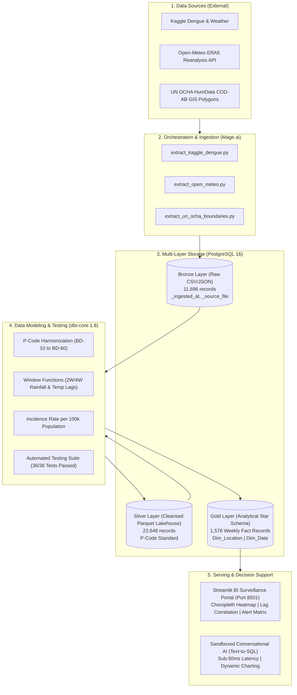
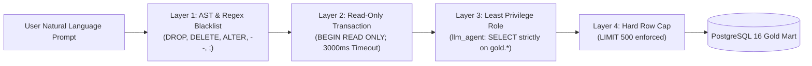

# Smart Health Data Platform: Epidemic & Climate Surveillance System

[](https://www.postgresql.org/)
[](https://www.mage.ai/)
[](https://www.getdbt.com/)
[](https://streamlit.io/)
[](https://www.docker.com/)
[](https://deepmind.google/technologies/gemini/)
[](file:///d:/Fresher26/mokProject/dbt_transforms)
[](https://opensource.org/licenses/MIT)

> An end-to-end, production-grade **Data Engineering & AI Surveillance Lakehouse** integrating epidemiological disease surveillance with meteorological signals and air-quality indicators. The system enables public health authorities to transition from **reactive crisis response** to **proactive outbreak prediction** by leveraging multi-week time-lag modeling and a sandboxed Conversational AI assistant.

---

## 🌟 Key Capabilities & Differentiators

* **Medallion Data Lakehouse Architecture:** Strict, idempotent separation between Raw Ingestion (`Bronze`), Cleansed & Harmonized Datasets (`Silver`), and Analytical Star Schema Marts (`Gold`).
* **Geospatial Harmonization (UN OCHA P-Codes):** Standardized administrative divisions (BD-10 to BD-60) with GeoJSON polygon boundaries and demographic census populations.
* **Epidemiological Time-Lag Feature Engineering:** Automated calculation of 2-week and 4-week rainfall and temperature lag features (`rainfall_lag_2w`, `rainfall_lag_4w`, `temp_lag_2w`) capturing the biological incubation cycle of the *Aedes* mosquito vector.
* **Population-Normalized Risk Metric:** Automated computation of **Incidence Rate per 100,000 population** to eliminate urban density distortion on choropleth heatmaps.
* **Automated Risk Stratification Matrix:** Real-time multi-factor classification categorizing administrative entities into `Severe`, `High`, `Moderate`, and `Low` risk alerts.
* **Conversational AI (Text-to-SQL Assistant):** Powered by Google Gemini 1.5 Flash and domain heuristic fallback, enabling clinicians and epidemiologists to query datamarts using natural language.
* **Predictive Machine Learning Outbreak Forecasting:** Supervised ensemble regression (`HistGradientBoostingRegressor` / `XGBoostRegressor`) projecting dengue incident cases 4 weeks in advance ($y_{t+4}$) with $R^2 = 0.7184$, 95% confidence intervals, and automated early warning surge classifications.
* **4-Layer Defense-in-Depth Security Sandbox:** Hardened SQL execution enforcing AST syntax blacklisting, read-only transactions, a 3000ms query timeout, database role least-privilege (`llm_agent`), and a hard row cap (`LIMIT 500`).

---

## 🏗️ Architecture Blueprint



---

## 🌐 Deployed Services & Port Map

| Service Name | Port | Description | Credentials / Access |
| :--- | :--- | :--- | :--- |
| **Streamlit BI & AI Assistant** | `http://localhost:8501` | Public Health Surveillance Portal & Text-to-SQL | Public / Browser Access |
| **Mage.ai Pipeline Orchestrator** | `http://localhost:6789` | Pipeline DAGs, Orchestration & Monitoring | Public / Developer Access |
| **PostgreSQL 16 Data Warehouse** | `localhost:5432` | Medallion Warehouse (`smart_health_dw`) | `de_admin`, `bi_reader`, `llm_agent` |

---

## 🚀 Quickstart Guide (Single-Command Setup)

### Prerequisites
* [Docker Desktop](https://www.docker.com/products/docker-desktop/) (v24.0+) & Docker Compose
* [Git](https://git-scm.com/)

### 1. Clone & Configure
```bash
git clone https://github.com/nguyenxuanthinh281204/smart-health-platform.git
cd smart-health-platform
cp .env.example .env
```

### 2. Launch Entire Infrastructure
```bash
docker compose -f docker/docker-compose.yml up -d
```
All containers (PostgreSQL 16, Mage.ai orchestrator, and Streamlit surveillance app) will spin up automatically.

### 3. Verify System Health
Run the automated infrastructure smoke test:
```powershell
python scripts/test_infra.py
```

### 4. Execute Full Pipeline Verification (Sprint Test Suites)
```powershell
# Sprint 2: Bronze Ingestion & Idempotency
powershell -ExecutionPolicy Bypass -File scripts/test_sprint2.ps1

# Sprint 3: Silver Cleansing & Lakehouse Parquet
powershell -ExecutionPolicy Bypass -File scripts/test_sprint3.ps1

# Sprint 4: Gold Star Schema & Streamlit BI Serving
powershell -ExecutionPolicy Bypass -File scripts/test_sprint4.ps1

# Sprint 5: Conversational AI (Text-to-SQL) & Security Sandbox
powershell -ExecutionPolicy Bypass -File scripts/test_sprint5.ps1

# Sprint 6: Predictive Machine Learning Outbreak Forecasting
powershell -ExecutionPolicy Bypass -File scripts/test_sprint6.ps1
```

---

## 📂 Project Repository Structure

```text
smart-health-platform/
├── docker/                         # Multi-container infrastructure definitions
│   └── docker-compose.yml          # PostgreSQL 16 + Mage.ai + Streamlit
├── data/                           # Local data lake storage (Git ignored)
│   ├── bronze/                     # Raw ingested data (CSV, JSON, GeoJSON)
│   ├── silver/                     # Cleansed lakehouse files (Parquet)
│   └── gold/                       # Materialized datamart exports
├── pipelines/                      # Ingestion pipelines & AI modules
│   ├── extract_kaggle_dengue.py    # Bronze ingestion: Kaggle surveillance
│   ├── extract_open_meteo.py       # Bronze ingestion: Open-Meteo ERA5 API
│   ├── extract_un_ocha_boundaries.py # Bronze ingestion: UN OCHA COD-AB Polygons
│   └── llm_text_to_sql.py          # 4-Layer sandboxed Text-to-SQL engine
├── dbt_transforms/                 # dbt-core dimensional modeling project
│   ├── models/
│   │   ├── staging/                # Staging views over Bronze schema
│   │   ├── intermediate/           # Cleaned Silver tables & P-Code harmonization
│   │   └── marts/                  # Gold tables: Dim_Location, Dim_Date, Fact
│   ├── macros/                     # Reusable SQL macros (time-lags, epi-weeks)
│   └── tests/                      # 36 data quality & integrity tests
├── bi_dashboard/                   # Streamlit interactive application
│   ├── app.py                      # Multi-tab BI surveillance portal & AI assistant
│   └── index.html                  # Standalone offline web dashboard fallback
├── scripts/                        # Automated smoke & regression test suites
│   ├── test_infra.py               # Container & port health check
│   ├── test_sprint2.ps1            # Bronze layer verification suite
│   ├── test_sprint3.ps1            # Silver layer verification suite
│   ├── verify_gold_layer.py        # 16-point Gold mart validation suite
│   ├── test_sprint4.ps1            # Streamlit BI serving test suite
│   └── test_sprint5.ps1            # Text-to-SQL & Security sandbox test suite
├── docs/                           # Authoritative Documentation & Specifications
│   ├── PRESENTATION_AND_DEFENSE_DECK.md # 12-slide final defense presentation deck
│   ├── ROADMAP.md                  # 5-Sprint project roadmap & delivery milestones
│   ├── USE_CASES_AND_ACTORS.md     # System personas, modules & operational use cases
│   ├── DATA_SPECIFICATION.md       # Data catalog, grain definitions & Star Schema
│   ├── DATA_CONTRACTS.md           # Strict column-level schemas (Bronze/Silver/Gold)
│   ├── DOMAIN_RULES_AND_METRICS.md # Clinical rules, Aedes incubation lags & alert matrix
│   ├── SECURITY_AND_GOVERNANCE.md  # Zero PII policy, RBAC roles & 4-layer sandbox
│   ├── NAMING_CONVENTIONS.md       # lower_snake_case for SQL & PEP 8 standards
│   └── PROMPT_TEMPLATES.md         # Production prompt templates for AI agents
├── AGENTS.md                       # Core AI Agent Operating Directive (Zero Context Loss)
├── TASK_TRACKER.md                 # Granular Sprint WBS with Definition of Done (DoD)
├── PROJECT_STATE.md                # Real-time state snapshot (Short-term RAM)
└── README.md                       # Master project documentation (This file)
```

---

## 🔒 Security, Governance & 4-Layer LLM Sandbox

Per `docs/SECURITY_AND_GOVERNANCE.md`, the platform enforces strict **Defense-in-Depth** and **Least Privilege**:



* **Role-Based Access Control (RBAC):**
  * `de_admin`: Full DDL/DML access for automated ETL and dbt builds.
  * `bi_reader`: Read-only `SELECT` access strictly on schema `gold` for BI dashboards.
  * `llm_agent`: Sandboxed read-only access strictly on schema `gold` with a 3-second query timeout.
* **Zero PII/PHI Policy:** No patient-level records are stored; all clinical cases are aggregated at the administrative division level with geospatial k-anonymity.

---

## 🏅 Automated Data Quality Assurance (dbt-core)

The Gold Analytical Mart is guarded by **36 automated dbt tests**:
* **100% Pass Rate (0 Failures, 0 Warnings)**.
* **Primary Key Uniqueness & Not-Null:** Verified on `fact_id`, `location_key`, and `date_key`.
* **Referential Integrity:** Relationships validated between facts and dimensions with zero orphaned records.
* **Domain Range Constraints:** Non-negative assertions on rainfall, humidity, cases, and hospitalization counts.

---

## 👥 Author & Academic Context

* **Lead Data Engineer & AI Architect:** Nguyen Xuan Thinh ([@nguyenxuanthinh281204](https://github.com/nguyenxuanthinh281204))
* **Email:** ngxthinh271@gmail.com
* **Academic Year:** 2026
* **Defense Deck:** [docs/PRESENTATION_AND_DEFENSE_DECK.md](file:///d:/Fresher26/mokProject/docs/PRESENTATION_AND_DEFENSE_DECK.md)

---

## 📄 License
This project is open-sourced under the [MIT License](LICENSE).
