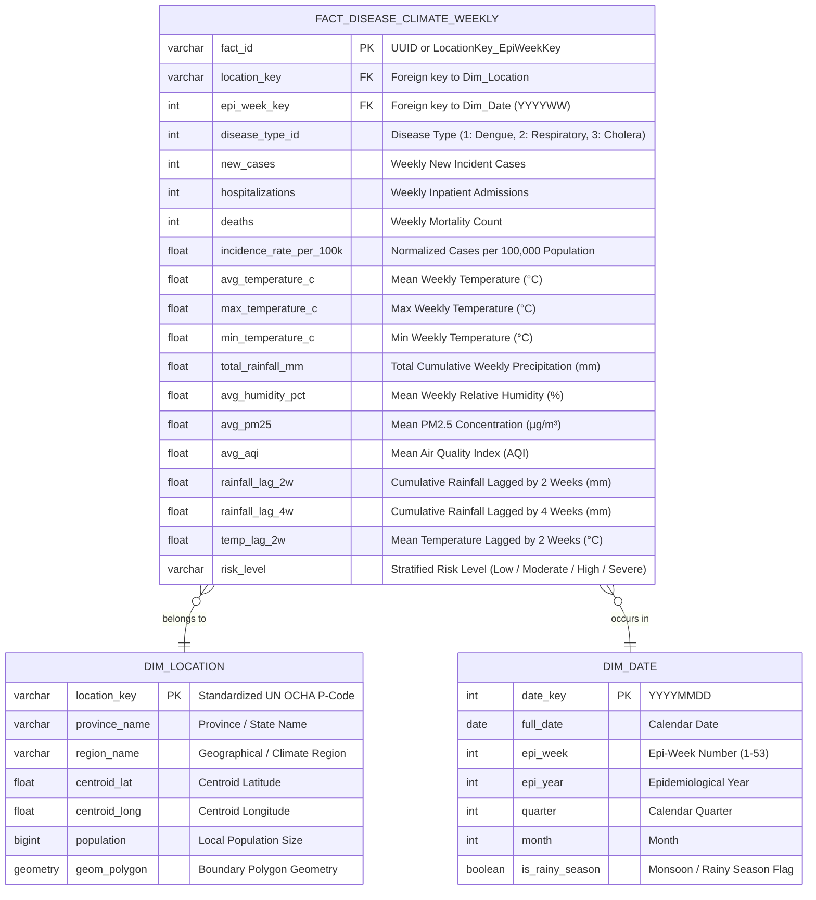

# DATA SPECIFICATION & ARCHITECTURAL MODELING

> **Purpose:** This document defines the comprehensive input data catalog, grain definitions, data dictionary, dimensional model (Star Schema), and mathematical formulations for the **Smart Health Data Platform**.

---

## 1. DATA SOURCE CATALOG (10 CURATED SOURCES)

*(Extracted directly from project specifications and verified open repositories)*

| ID | Dataset / Source | Category | Format | Technical Role & Value |
| :---: | :--- | :--- | :---: | :--- |
| **1** | [Air Quality, Weather & Respiratory Health](https://www.kaggle.com/datasets/khushikyad001/air-quality-weather-and-respiratory-health) | Micro Data | CSV | Pre-integrated AQI, PM2.5, PM10, temperature, humidity, and respiratory admissions. Secondary Fact table. |
| **2** | [Dengue & Weather Data (Bangladesh 2022-2025)](https://www.kaggle.com/datasets/brownsugar297/dengue-and-weather-data-bangladesh-20222025/data) | Micro Data | CSV | **Core Fact Dataset:** ~11,088 records covering daily dengue cases, max/min temp, rainfall, and humidity across 8 divisions. Optimal for testing 2–4 week lag features. |
| **3** | [AQI Relation to Respiratory Death Rate](https://www.kaggle.com/datasets/jsmith51/aqi-relation-to-respiratory-death-rate) | Macro Data | CSV | 20-year longitudinal county-level data correlating respiratory mortality with unhealthy AQI day counts. |
| **4** | [Dengue Incidents & Weather Data](https://www.kaggle.com/datasets/fazlyrabbi/dengue-incidents-weather-of-bangladesh) | Micro Data | CSV | Monthly observations validating thresholds where humidity > 80% and rainfall > 50mm trigger surges. |
| **5** | [Local Epidemics of Dengue Fever (DengAI Benchmark)](https://www.kaggle.com/datasets/arashnic/epidemy) | Benchmark Data | CSV | Standard competition benchmark providing NOAA weather indicators, NDVI vegetation index, and Epi-week case counts. |
| **6** | [Global Air Pollution & Respiratory Risks](https://www.kaggle.com/datasets/hasibalmuzdadid/global-air-pollution-dataset/data) | Environmental Data | CSV | Global dataset across >23,000 cities providing PM2.5, PM10, NO2, O3, and CO concentrations. |
| **7** | [WHO Global Cholera Dataset](https://data.humdata.org/dataset/world-health-organization-who-cholera-data) | Micro/Macro Data | XLSX/CSV | Weekly reported cholera cases and mortality monitoring disease surges linked to flood events. |
| **8** | [Reported Cases of Cholera (Our World in Data)](https://ourworldindata.org/grapher/number-reported-cases-of-cholera) | Macro Data | CSV | Long-term validated global cholera cases ideal for automated ingestion pipeline testing. |
| **9** | [Vietnam Sub-national Administrative Boundaries (HDX UN OCHA)](https://data.humdata.org/dataset/cod-ab-vnm) | Geospatial Master | GeoJSON / Shapefile | **Core Dimension Dataset:** Authoritative administrative polygon boundaries and P-Codes for provinces and districts to power Choropleth maps. |
| **10** | [COVID-19 Time-Series (JHU CSSE)](https://github.com/CSSEGISandData/COVID-19/tree/master/csse_covid_19_data/csse_covid_19_time_series) | Micro Data | CSV | Classic time-series benchmark dataset for wide-to-long unpivoting and deduplication pipelines. |

---

## 2. GRANULARITY & GRAIN DEFINITION

* **Real-World Constraint:** 
  * Meteorological observations are recorded **hourly or daily**.
  * Public health surveillance metrics are aggregated by health authorities on an **Epidemiological Week (Epi-week)** basis.
* **Gold Fact Table Grain Definition:**
  $$\mathbf{Grain:}\quad \text{One record represents exactly: } [1\text{ Administrative Unit (Admin-1 / Admin-2)}] \times [1\text{ Epidemiological Week (Epi-week)}]$$
* **Aggregation Rules:**
  * Daily weather features are aggregated across the 7-day Epi-week: cumulative sum for rainfall; arithmetic mean, max, and min for temperature, humidity, and atmospheric particulate matters (PM2.5, AQI).

---

## 3. DATA WAREHOUSE ARCHITECTURE: STAR SCHEMA



---

## 4. DOMAIN FORMULATIONS & TIME-LAG FEATURE ENGINEERING

### 4.1. Normalized Incidence Rate per 100,000 Population
$$\text{Incidence Rate} = \left(\frac{\text{Total Weekly Cases}}{\text{Mean Local Population}}\right) \times 100,000$$
* **Epidemiological Rationale:** Raw counts introduce severe population bias. A metropolitan area with 1,000 cases across 10 million residents yields 10 cases / 100k, whereas a rural district with 100 cases across 50,000 residents yields 200 cases / 100k (20x higher actual individual risk). This normalized metric serves as the color scale for Choropleth maps.

### 4.2. Time-Lag Feature Formulation (SQL Window Functions)
Implemented natively within dbt transformations:
```sql
-- Cumulative precipitation lagged by 2 and 4 weeks per geographical entity
LAG(total_rainfall_mm, 2) OVER (
    PARTITION BY location_key 
    ORDER BY epi_week_key
) AS rainfall_lag_2w,

LAG(total_rainfall_mm, 4) OVER (
    PARTITION BY location_key 
    ORDER BY epi_week_key
) AS rainfall_lag_4w,

-- Mean temperature lagged by 2 weeks
LAG(avg_temperature_c, 2) OVER (
    PARTITION BY location_key 
    ORDER BY epi_week_key
) AS temp_lag_2w
```
* **Biological Context:** Rain pool accumulation provides breeding habitats for *Aedes aegypti* mosquitoes. The developmental progression from egg to larvae/pupae requires 7–10 days, followed by adult viral incubation (extrinsic incubation period) of 8–12 days. The resulting clinical surge manifests with a **2 to 4-week lag**.
