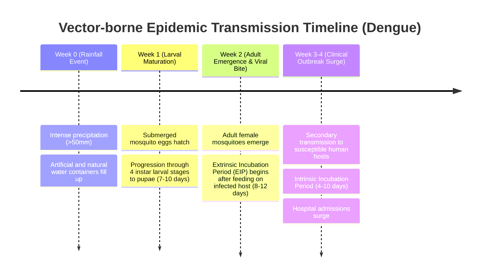

# EPIDEMIOLOGICAL DOMAIN RULES & CLINICAL METRICS

> **Target Audience:** AI Coding Agents & Data Engineers  
> **Mandatory Rule:** All transformation algorithms, risk scoring CASE statements in dbt, and LLM query answers MUST derive from the domain definitions specified in this document.

---

## 1. EPIDEMIOLOGICAL WEEK (EPI-WEEK) SPECIFICATION

### 1.1. International Standard Selection
Public health data follows standard epidemiological time windows. This platform standardizes on the **ISO-8601 Week Standard** (Monday to Sunday) across all SQL transformations for deterministic calendar alignment:
* **Start of Week:** Monday (`00:00:00`)
* **End of Week:** Sunday (`23:59:59`)
* **Week 1 Rule:** The week containing the first Thursday of the calendar year.
* **PostgreSQL Date Truncation:** `to_char(record_date, 'IYYYIW')::integer` yields the 6-digit `epi_week_key` (e.g., date `2024-10-04` $\to$ key `202440`).

---

## 2. BIOLOGICAL MECHANISMS: VECTOR LIFE-CYCLE & TIME-LAGS

### 2.1. Why 2-Week and 4-Week Time-Lags Matter (*Aedes aegypti / albopictus*)
Dengue virus transmission is biologically coupled to precipitation and ambient temperature through distinct non-linear stages:



### 2.2. Environmental Threshold Parameters:
* **Optimum Temperature Range:** $26^\circ\text{C} - 32^\circ\text{C}$ (accelerates larval development and shortens the Extrinsic Incubation Period).
* **Thermal Inactivation:** Temperatures $< 16^\circ\text{C}$ or $> 38^\circ\text{C}$ halt virus replication inside the mosquito vector.
* **Relative Humidity Threshold:** Sustained humidity $> 75\%$ significantly extends adult mosquito lifespan, enabling multiple infectious blood meals.

---

## 3. POPULATION-NORMALIZED INCIDENCE RATE

To eradicate population density distortion when comparing high-density urban areas with rural provinces:

$$\mathbf{Incidence\ Rate\ (per\ 100,000\ population)} = \left(\frac{\sum \text{New Cases in Epi-Week}}{\text{Local Census Population}}\right) \times 100,000$$

### Interpretation Scale:
* **$< 5.0$ / 100k:** Baseline / Endemic baseline.
* **$5.0 - 19.9$ / 100k:** Low to Moderate transmission.
* **$20.0 - 49.9$ / 100k:** High transmission / Emerging localized outbreak.
* **$\ge 50.0$ / 100k:** Epidemic alert / System overload risk.

---

## 4. MULTI-FACTOR RISK STRATIFICATION MATRIX

This algorithm must be compiled as a standardized dbt macro or SQL `CASE` statement inside `fact_disease_climate_weekly`:

```sql
CASE
    -- 1. SEVERE (Red Alert): Critical disease burden OR combined high cases with severe climate triggers
    WHEN incidence_rate_per_100k >= 50.0 
      OR (incidence_rate_per_100k >= 20.0 AND rainfall_lag_2w >= 80.0 AND avg_humidity_pct >= 80.0)
    THEN 'Severe'

    -- 2. HIGH (Orange Alert): Significant transmission OR moderate cases with upcoming climate surge
    WHEN incidence_rate_per_100k >= 20.0
      OR (incidence_rate_per_100k >= 10.0 AND rainfall_lag_2w >= 50.0 AND temp_lag_2w BETWEEN 26.0 AND 32.0)
    THEN 'High'

    -- 3. MODERATE (Yellow Alert): Notable cases OR strong breeding indicators preceding clinical surge
    WHEN incidence_rate_per_100k >= 5.0
      OR (rainfall_lag_2w >= 60.0 AND avg_humidity_pct >= 75.0)
      OR (rainfall_lag_4w >= 100.0)
    THEN 'Moderate'

    -- 4. LOW (Green / Normal): Minimal disease activity within historical norms
    ELSE 'Low'
END AS risk_level
```

---

## 5. ACTIONABLE PUBLIC HEALTH INTERVENTIONS

The BI Dashboard and LLM Assistant must recommend specific operational interventions based on the computed `risk_level`:

| Risk Level | Visual Color Code | Operational Decision / Public Health Action |
| :--- | :---: | :--- |
| **Severe** | **Red (`#E53935`)** | Immediate emergency response: Targeted chemical fogging (thermal/ULV), activate surge capacity in local hospitals, deploy emergency vector control task forces. |
| **High** | **Orange (`#FB8C00`)** | Mobilize community larvicide application (Abate), inspect standing water containers in high-density wards, issue public localized health warnings. |
| **Moderate** | **Yellow (`#FDD835`)** | Intensified vector surveillance, cleaning municipal drainage systems, pre-positioning diagnostic kits and IV fluids at district clinics. |
| **Low** | **Green (`#43A047`)** | Routine epidemiological surveillance and public hygiene awareness campaigns. |

---

## 6. 4-WEEK FORWARD PREDICTIVE MACHINE LEARNING FORMULATION

### 6.1. Objective & Target Horizon
To provide public health directors with an actionable **4-week advance outbreak warning window**, the system trains a supervised ensemble regression model predicting future dengue incident cases $y_{i, t+4}$:
$$\hat{y}_{i, t+4} = f\left(\mathbf{X}_{i, t}; \mathbf{\Theta}\right)$$
where $i$ indexes the administrative division and $t$ denotes the current epidemiological observation week.

### 6.2. Feature Matrix Specification ($\mathbf{X}_{i, t}$)
1. **Autoregressive Clinical Lags:** Current week cases $y_{i, t}$, lag-1 week $y_{i, t-1}$, lag-2 week $y_{i, t-2}$, lag-3 week $y_{i, t-3}$.
2. **Antecedent Meteorological Triggers:**
   * $\text{rainfall\_lag\_2w}$ & $\text{rainfall\_lag\_4w}$ (Precipitation accumulation driving breeding sites).
   * $\text{temp\_lag\_2w}$ (Temperature optimal range 26–32°C modulating viral extrinsic incubation).
   * $\text{avg\_humidity\_pct}$ & $\text{avg\_temperature\_c}$ (Concurrent ambient indicators).
3. **Cyclical Seasonality Signals:**
   $$\text{sin\_week} = \sin\left(\frac{2\pi \cdot \text{epi\_week}}{52}\right), \quad \text{cos\_week} = \cos\left(\frac{2\pi \cdot \text{epi\_week}}{52}\right)$$
4. **Demographic Normalization:** Regional baseline census population ($P_i$).

### 6.3. Evaluation & Uncertainty Quantification
* **Loss Function:** Mean Squared Error (MSE) with Huber / L1 regularization.
* **Performance Metrics:** Out-of-sample Coefficient of Determination ($R^2$), Mean Absolute Error ($\text{MAE}$), and Root Mean Squared Error ($\text{RMSE}$).
* **Empirical 95% Confidence Interval:**
  $$\text{CI}_{95\%} = \left[\max\left(0, \hat{y} - 1.96 \cdot \text{RMSE}\right), \; \hat{y} + 1.96 \cdot \text{RMSE}\right]$$
* **Projected Risk Level:**
  $$\hat{\text{Incidence}}_{100k} = \frac{\hat{y}_{i, t+4}}{P_i} \times 100,000$$
  Classified via the standard 4-tier alert threshold defined in Section 4.

