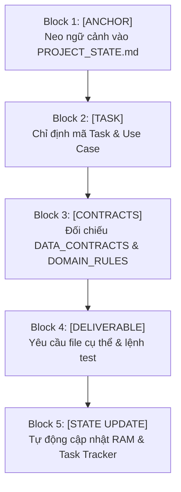

# PRODUCTION PROMPT ENGINEERING FRAMEWORK & TEMPLATES

> **Target Audience:** Developers & AI Engineers  
> **Purpose:** This document provides the **Master 5-Block Prompting Framework** and **Ready-to-Use Copy-Paste Templates** designed specifically for Vibe Coding on the Smart Health Data Platform.

---

## 1. THE MASTER 5-BLOCK PROMPTING FORMULA (CẤU TRÚC PROMPT 5 KHỐI)

To guarantee that any AI agent produces production-ready code with **Zero Hallucination** and **Strict Business Compliance**, every prompt should follow this 5-block formula:

$$\mathbf{Prompt} = \mathbf{[Anchor]} + \mathbf{[Task]} + \mathbf{[Contracts]} + \mathbf{[Deliverable]} + \mathbf{[State\ Update]}$$



### The 5 Core Components Breakdown:

| Block | Tên Khối | Mục Đích Kỹ Thuật | File Tham Chiếu Bắt Buộc |
| :---: | :--- | :--- | :--- |
| **1** | **[ANCHOR] Neo Ngữ Cảnh** | Ép AI đọc lại bộ nhớ ngắn hạn, xác định đang ở Sprint nào, tránh lạc đề. | `PROJECT_STATE.md`, `TASK_TRACKER.md` |
| **2** | **[TASK] Mục Tiêu Cụ Thể** | Định vị chính xác micro-task cần làm và nghiệp vụ giải quyết. | `docs/USE_CASES_AND_ACTORS.md` |
| **3** | **[CONTRACTS] Ràng Buộc** | Chống bịa tên cột, chống sai kiểu dữ liệu, bắt buộc bảo mật & naming chuẩn. | `docs/DATA_CONTRACTS.md`<br>`docs/DOMAIN_RULES_AND_METRICS.md`<br>`docs/SECURITY_AND_GOVERNANCE.md`<br>`docs/NAMING_CONVENTIONS.md` |
| **4** | **[DELIVERABLE] Đầu Ra & Test** | Chỉ định rõ tạo file nào, viết hàm gì và cung cấp lệnh kiểm thử thực tế. | File path đích, CLI test commands |
| **5** | **[STATE UPDATE] Lưu Vết** | Ép AI tự động đánh dấu `[x]` và cập nhật 3 việc tiếp theo vào STATE trước khi dừng. | `TASK_TRACKER.md`, `PROJECT_STATE.md` |

---

### Khung Mẫu Điền Từ (Universal Prompt Template):

```markdown
[ANCHOR]: Dựa vào PROJECT_STATE.md và TASK_TRACKER.md, hãy xác định vị trí hiện tại của dự án.
[TASK]: Chúng ta sẽ thực hiện Task [Điền mã Task, ví dụ: Task 1.4: Viết docker-compose.yml] để phục vụ [Điền mã Use Case, ví dụ: UC-10].
[CONTRACTS]: 
- Tên bảng và tên cột phải tuân thủ nghiêm ngặt docs/DATA_CONTRACTS.md.
- Đặt tên theo chuẩn docs/NAMING_CONVENTIONS.md (lower_snake_case).
- Tuân thủ phân quyền RBAC và bảo mật trong docs/SECURITY_AND_GOVERNANCE.md.
[DELIVERABLE]: Hãy tạo file [Đường dẫn file] và cung cấp lệnh chạy thử kiểm tra.
[STATE UPDATE]: Sau khi kiểm tra thành công, hãy tự động đánh dấu [x] vào TASK_TRACKER.md và cập nhật PROJECT_STATE.md.
```

---

## 2. PRODUCTION COPY-PASTE PROMPT TEMPLATES

### Template 1: Khởi động phiên làm việc mới (Zero-Context Resume)
*Dùng khi mở một cuộc trò chuyện mới hoặc sau khi khởi động lại máy:*

```markdown
Hello. We are continuing the development of the "Smart Health Data Platform: Epidemic & Climate Surveillance System".

In accordance with the mandatory operating directives in AGENTS.md:
1. Inspect PROJECT_STATE.md and TASK_TRACKER.md to determine the active Sprint, the most recently completed task, and the immediate next task.
2. Provide a 2-sentence executive summary of the current project state.
3. Proceed immediately with executing the next sequential task on the roadmap.
```

---

### Template 2: Viết Pipeline Ingestion / Trích xuất dữ liệu (Data Ingestion)
*Dùng cho các Task Ingestion tầng Bronze:*

```markdown
Dựa vào PROJECT_STATE.md, chúng ta tiến hành Task [Ví dụ: Task 1.6: Xây dựng script Ingestion thời tiết Open-Meteo].

Yêu cầu kỹ thuật:
- Tầng lưu trữ: Bronze layer schema (raw_weather_daily).
- Bắt buộc bổ sung 2 cột audit: _ingested_at (TIMESTAMPTZ) và _source_file (VARCHAR).
- Tuân thủ các cột quy định trong docs/DATA_CONTRACTS.md.
- Viết code Python có xử lý ngoại lệ (try-except), cơ chế retry (exponential backoff) và type hints theo docs/NAMING_CONVENTIONS.md.
- Hoàn thành xong, hãy tự động tích [x] vào TASK_TRACKER.md và cập nhật PROJECT_STATE.md.
```

---

### Template 3: Viết Model dbt / Biến đổi dữ liệu (Transformation & Feature Engineering)
*Dùng cho các Task tầng Silver và Gold trong Sprint 2 & 3:*

```markdown
Chúng ta thực hiện Task [Ví dụ: Task 3.4: Viết dbt model cho Fact_Disease_Climate_Weekly].

Yêu cầu kỹ thuật:
- Đọc kỹ docs/DATA_CONTRACTS.md để lấy đúng tên các cột đầu vào và đầu ra.
- Đọc docs/DOMAIN_RULES_AND_METRICS.md để áp dụng đúng công thức:
  + Tỷ lệ mắc chuẩn hóa: (total_cases / population) * 100000.
  + Hàm trễ thời gian: rainfall_lag_2w, rainfall_lag_4w, temp_lag_2w.
  + Ma trận rủi ro risk_level (Severe, High, Moderate, Low).
- Viết kèm file schema.yml định nghĩa test: unique, not_null trên primary key và relationships.
- Chạy thử lệnh dbt run / dbt test và cập nhật lại TASK_TRACKER.md.
```

---

### Template 4: Xây dựng Dashboard / Giao diện người dùng (UI/UX Engineering)
*Dùng cho các Task trực quan hóa tầng Serving trong Sprint 4:*

```markdown
Chúng ta tiến hành Task [Ví dụ: Task 4.2: Xây dựng bản đồ nhiệt 3D Choropleth trên Streamlit].

Yêu cầu thiết kế:
- Tuân thủ nghiêm ngặt quy chuẩn giao diện trong .agents/rules/modern_health_ui.md.
- Áp dụng theme tối Dark Obsidian (#0B0F19), thẻ chỉ số kính mờ Glassmorphism và bảng màu rủi ro y tế chuẩn (Xanh, Vàng, Cam, Đỏ Neon).
- Tích hợp PyDeck 3D map có thanh trượt timeline chọn tuần dịch tễ (Epi-week) và tooltip chi tiết.
- Cập nhật tiến độ vào TASK_TRACKER.md và PROJECT_STATE.md.
```

---

### Template 5: Xử lý lỗi & Gỡ lỗi (Debugging / Troubleshooting)
*Dùng khi chạy lệnh docker, python hoặc dbt bị báo lỗi:*

```markdown
Tôi gặp lỗi sau khi thực thi hệ thống:
```
[DÁN NỘI DUNG LỖI VÀO ĐÂY]
```

Hãy giúp tôi:
1. Phân tích nguyên nhân gốc rễ (Root Cause) của lỗi.
2. Kiểm tra xem lỗi có vi phạm docs/DATA_CONTRACTS.md hay docs/SECURITY_AND_GOVERNANCE.md không.
3. Đưa ra giải pháp sửa đổi cụ thể và lệnh kiểm tra lại sau khi sửa.
```

---

### Template 6: Kết thúc phiên làm việc & Lưu vết (Session Handoff)
*Dùng trước khi nghỉ để AI lưu lại toàn bộ tiến độ:*

```markdown
Chúng ta chuẩn bị kết thúc phiên làm việc hôm nay.

Hãy giúp tôi:
1. Rà soát lại tất cả những gì chúng ta đã hoàn thành trong phiên này.
2. Cập nhật chi tiết vào PROJECT_STATE.md (Mục "Recently Completed Tasks" và "Next Immediate Steps").
3. Đánh dấu [x] các task đã hoàn tất trong TASK_TRACKER.md.
4. Nêu rõ 3 việc đầu tiên cần làm ngay khi mở phiên tiếp theo.
```
