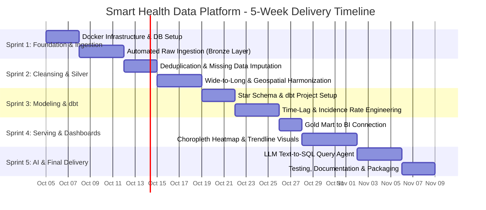
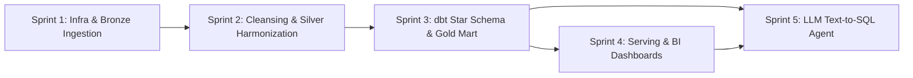

# SMART HEALTH DATA PLATFORM: COMPREHENSIVE SPRINT ROADMAP

> **Document Classification:** Engineering Management & Delivery Milestones  
> **Primary Methodology:** Agile / Scrum Data Engineering Sprints  
> **Total Estimated Duration:** 5 Sprints (5 Weeks / ~160 Working Hours)  
> **Status:** Active Execution  

---

## 1. EXECUTIVE TIMELINE OVERVIEW

---

## 2. HIGH-LEVEL SPRINT SUMMARY MATRIX

| Sprint | Focus Area | Core Technologies | Primary Deliverable | Target Timeline |
| :---: | :--- | :--- | :--- | :---: |
| **Sprint 1** | Container Infra & Raw Data Ingestion | Docker, PostgreSQL 16, Mage.ai, Python | Functional Docker environment, Bronze Layer storage populated with raw CSV/JSON. | Week 1 |
| **Sprint 2** | Data Cleansing & Harmonization | Python, Pandas/Polars, SQL, UN OCHA P-Codes | Silver Layer: deduplicated, unpivoted long tables, harmonized location entities. | Week 2 |
| **Sprint 3** | Data Warehouse & dbt Modeling | dbt-core 1.7+, PostgreSQL, SQL Window Functions | Gold Layer Star Schema (`Dim_Date`, `Dim_Location`, `Fact_Disease_Climate_Weekly`), Lag 2–4W. | Week 3 |
| **Sprint 4** | Serving Layer & BI Visualization | Looker Studio / Metabase / Streamlit, Mapbox | Interactive Choropleth maps, dual-axis correlation curves, automated risk matrix. | Week 4 |
| **Sprint 5** | AI Integration & Project Packaging | Python, LangChain, Gemini/OpenAI API, Streamlit | Text-to-SQL epidemiological agent, `docker-compose` 1-click boot, defense slide deck. | Week 5 |

---

## 3. DETAILED SPRINT BREAKDOWN & MILESTONES

### 🔹 SPRINT 1: FOUNDATION, MULTI-CONTAINER INFRASTRUCTURE & RAW INGESTION
* **Objective:** Establish the containerized runtime environment and ingest raw health/climate data into the Bronze Layer without schema mutation.
* **Key Milestones:**
  1. Repository layout initialized following enterprise Data Engineering best practices.
  2. Multi-container infrastructure orchestrated via `docker/docker-compose.yml` (PostgreSQL 16 on `:5432` with health checks, Mage.ai on `:6789`).
  3. Batch ingestion script for Kaggle Dengue & Weather datasets.
  4. Geospatial administrative polygon boundary ingestion from UN OCHA HumData.
  5. API ingestion pipeline polling Open-Meteo API for historical meteorological metrics.
  6. Audit metadata columns (`_ingested_at`, `_source_file`) injected into all Bronze tables.
* **Exit Gate / Deliverable:** Bronze layer populated in PostgreSQL; Mage.ai orchestrator running successfully.

---

### 🔹 SPRINT 2: DATA CLEANSING, WIDE-TO-LONG RESHAPING & SILVER LAYER
* **Objective:** Eliminate data silos, harmonize disparate spatial identifiers, and resolve missing records into a clean Silver Layer.
* **Key Milestones:**
  1. Idempotent record deduplication pipeline targeting patient admission logs.
  2. Reshaping COVID/epidemiological time-series from Wide format to standardized Long format.
  3. Geospatial Harmonization: Fuzzy matching and mapping localized district/provincial strings into ISO UN OCHA P-Codes.
  4. Missing Data Imputation: Time-series forward-fill and rolling averages for missing sensor and rainfall records.
  5. Parquet / Silver relational table persistence with verified data types.
* **Exit Gate / Deliverable:** Clean Silver schema containing unified time-series ready for dimensional modeling.

---

### 🔹 SPRINT 3: DATA WAREHOUSING, STAR SCHEMA & DBT TRANSFORMATIONS (GOLD LAYER)
* **Objective:** Architect the analytical datamart using dbt-core and execute epidemiological feature engineering.
* **Key Milestones:**
  1. Initialize `dbt-core` project with profiles, sources, and staging models.
  2. Construct Conformed Dimensions:
     * `Dim_Location`: Spatial centroids, population demographics, administrative hierarchy.
     * `Dim_Date`: Calendar dates mapped to Epidemiological Weeks (Epi-week 1–53) and monsoon seasons.
  3. Construct Fact Table `Fact_Disease_Climate_Weekly`:
     * Grain: `(location_key, epi_week_key)`.
  4. Implement Analytical Metrics:
     * **Incidence Rate per 100,000 Population** (population-normalized risk).
     * **Time-Lag Window Functions:** 2-week and 4-week rainfall lag (`rainfall_lag_2w`, `rainfall_lag_4w`) and 2-week temperature lag (`temp_lag_2w`).
  5. Enforce dbt schema tests (`unique`, `not_null`, `relationships` referential integrity).
  6. Generate comprehensive data lineage documentation (`dbt docs generate`).
* **Exit Gate / Deliverable:** Gold Layer verified with 100% passing dbt tests; interactive lineage DAG generated.

---

### 🔹 SPRINT 4: SERVING LAYER & INTERACTIVE EPIDEMIOLOGICAL DASHBOARDS
* **Objective:** Connect the analytical datamart to visualization tools to provide actionable decision-support for public health officials.
* **Key Milestones:**
  1. Establish high-performance read-only connection from Gold Layer to Looker Studio / Metabase.
  2. Build **Choropleth Heatmap**: Color-coded visualization of Incidence Rate / 100k population with dynamic Epi-week timeline slider.
  3. Build **Time-Lag Correlation Visualizations**: Dual-axis line charts validating the biological lag between peak rainfall and epidemic surges.
  4. Build **Risk Alerting Matrix**: Multi-condition threshold filter flagging areas with sustained humidity > 80% and rainfall > 50mm.
* **Exit Gate / Deliverable:** Fully responsive, interactive public health dashboard operational.

---

### 🔹 SPRINT 5: AI INTEGRATION (TEXT-TO-SQL AGENT) & FINAL SYSTEM PACKAGING
* **Objective:** Integrate natural language interface for data querying and package the platform for final capstone defense.
* **Key Milestones:**
  1. Develop Python-based Text-to-SQL translation agent using Gemini API / OpenAI API.
  2. Ground LLM prompt with Gold Layer schema metadata and few-shot epidemiological domain queries.
  3. Build conversational Streamlit UI allowing clinicians to ask: *"Which province has the highest dengue surge risk in the next 2 weeks?"*.
  4. Author comprehensive production `README.md` with 1-click deployment guide.
  5. Produce presentation slide deck and video demonstration of the automated data pipeline.
* **Exit Gate / Deliverable:** Complete, production-ready repository with AI assistant and defense materials.

---

## 4. CROSS-SPRINT DEPENDENCY GRAPH

---

## 5. RISK MANAGEMENT & CONTINGENCY PROTOCOLS

| Risk Factor | Impact | Mitigation Protocol |
| :--- | :---: | :--- |
| **API Rate Limits (Open-Meteo / OpenAQ)** | Medium | Implement caching at the Bronze Layer and exponential backoff retry logic in Python. |
| **P-Code Misalignment across Datasets** | High | Establish a manual override lookup dictionary in `Dim_Location` for unrecognized provincial aliases. |
| **Computational Overhead in Window Functions** | Medium | Ensure database indexing on `(location_key, epi_week_key)` within PostgreSQL. |
| **LLM SQL Hallucination** | Medium | Constrain LLM query generation with strict schema prompting and SQL execution sandboxing (Read-Only transactions). |
