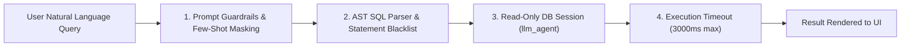

# SECURITY, DATA GOVERNANCE & PRIVACY SPECIFICATION

> **Document Status:** Authoritative Security Standard  
> **Target Audience:** Data Engineers, AI Architects, and System Administrators  
> **Mandatory Rule:** All Docker configurations, database migrations, Python pipelines, and LLM query modules MUST strictly comply with the protocols defined herein.

---

## 1. DATA PRIVACY & HEALTH INFORMATION PROTECTION (HIPAA / GDPR ALIGNMENT)

Although the Smart Health Data Platform aggregates population-level surveillance statistics, public health systems must inherently adhere to strict data protection standards to prevent de-anonymization:

* **Zero PII/PHI Ingestion Policy:**  
  * The platform **strictly forbids** ingesting Personally Identifiable Information (PII) or Protected Health Information (PHI) — including patient names, national identification numbers, phone numbers, exact home addresses, or IP addresses.
* **Geospatial & Temporal K-Anonymity:**  
  * Surveillance data must never be reported below the district/sub-district level (`Admin-2` or `Admin-3`).
  * If a rural district reports fewer than 3 incident cases in an Epi-week, individual identification risk is mitigated through aggregated reporting.
* **Secondary Use Compliance:**  
  * All datasets ingested from Kaggle, WHO, OpenDengue, and HDX are verified public domain / open access datasets under CC-BY 4.0 or Open Database Licenses (ODbL).

---

## 2. DATABASE ACCESS CONTROL & ROLE-BASED ACCESS (RBAC)

The PostgreSQL Data Warehouse enforces the **Principle of Least Privilege (PoLP)** by creating three isolated database roles:

```mermaid
graph TD
    subgraph Users["Database Roles & Personas"]
        AdminRole["Role: de_admin<br/>(Data Engineering & dbt)"]
        BIRole["Role: bi_reader<br/>(Looker Studio & Metabase)"]
        LLMRole["Role: llm_agent<br/>(Text-to-SQL Assistant)"]
    end

    subgraph Schemas["Data Warehouse Schemas"]
        Bronze[("bronze.*<br/>Raw Data")]
        Silver[("silver.*<br/>Clean Data")]
        Gold[("gold.*<br/>Analytical Marts")]
    end

    AdminRole -->|ALL PRIVILEGES| Bronze
    AdminRole -->|ALL PRIVILEGES| Silver
    AdminRole -->|ALL PRIVILEGES| Gold

    BIRole -->|SELECT ONLY| Gold
    LLMRole -->|SELECT ONLY (Read-Only Session)| Gold
```

### 2.1. Role Permissions Definition

```sql
-- 1. Create Dedicated Roles
CREATE ROLE de_admin WITH LOGIN PASSWORD '${POSTGRES_ADMIN_PASSWORD}';
CREATE ROLE bi_reader WITH LOGIN PASSWORD '${POSTGRES_BI_PASSWORD}';
CREATE ROLE llm_agent WITH LOGIN PASSWORD '${POSTGRES_LLM_PASSWORD}';

-- 2. de_admin: Full DDL and DML access across all layers
GRANT ALL PRIVILEGES ON DATABASE smart_health_dw TO de_admin;
GRANT ALL PRIVILEGES ON ALL SCHEMAS IN DATABASE smart_health_dw TO de_admin;

-- 3. bi_reader: Read-Only access restricted exclusively to the Gold Mart
GRANT USAGE ON SCHEMA gold TO bi_reader;
GRANT SELECT ON ALL TABLES IN SCHEMA gold TO bi_reader;
ALTER DEFAULT PRIVILEGES IN SCHEMA gold GRANT SELECT ON TABLES TO bi_reader;

-- 4. llm_agent: Read-Only access strictly on Gold Mart
GRANT USAGE ON SCHEMA gold TO llm_agent;
GRANT SELECT ON ALL TABLES IN SCHEMA gold TO llm_agent;
ALTER DEFAULT PRIVILEGES IN SCHEMA gold GRANT SELECT ON TABLES TO llm_agent;
```

---

## 3. TEXT-TO-SQL & LLM AGENT DEFENSE-IN-DEPTH

Directing an LLM to generate SQL against a relational database introduces severe security vectors (SQL Injection, Cartesian Denial of Service, unauthorized data tampering). The system enforces a **4-layer sandbox defense**:



1. **Layer 1: Statement Blacklist (Syntax Filter):**  
   The Python execution engine intercepts generated SQL before transmission. If any forbidden keyword is detected (`DROP`, `DELETE`, `UPDATE`, `INSERT`, `ALTER`, `TRUNCATE`, `GRANT`, `REVOKE`, `EXEC`, `CREATE`), the query is aborted immediately.
2. **Layer 2: Read-Only Transaction Enclosure:**  
   Every LLM-generated query is wrapped in an explicit read-only block:
   ```sql
   BEGIN READ ONLY;
   SET STATEMENT_TIMEOUT = '3000ms'; -- Prevents DoS via Cartesian Joins
   [LLM_GENERATED_SQL];
   COMMIT;
   ```
3. **Layer 3: Schema Confinement:**  
   The `llm_agent` role has zero permissions to view `bronze`, `silver`, `pg_catalog`, or `information_schema` tables.
4. **Layer 4: Row Limit Hard-Cap:**  
   The backend enforces `LIMIT 500` on any query lacking an explicit row cap to avoid memory exhaustion in the Streamlit frontend.

---

## 4. SECRETS MANAGEMENT & REPOSITORY SANITIZATION

* **Zero Hardcoded Secrets Policy:**  
  * Passwords, database connection strings, Open-Meteo tokens, and Gemini/OpenAI API keys must NEVER be written into source code or committed to Git.
* **Environment Configuration Hierarchy:**  
  * `.env.example`: Committed to version control, containing placeholder keys only.
  * `.env`: Listed in `.gitignore`, containing real credentials on local/staging machines.
* **Pre-commit Secret Scanning:**  
  * Developers and AI Agents must verify that `.env`, `*.pem`, `*.key`, and credential files are untracked prior to executing `git commit`.

---

## 5. CONTAINER & NETWORK HARDENING

* **Internal Docker Network Isolation:**  
  * Containers communicate over a dedicated bridge network (`smart_health_net`).
* **Port Exposure Control:**  
  * In production deployments, PostgreSQL port `5432` must be bound exclusively to `127.0.0.1:5432` or accessible only within the Docker internal network (not exposed to `0.0.0.0`).
* **API Ingestion Rate Limiting:**  
  * Ingestion pipelines polling Open-Meteo and OpenAQ must enforce Exponential Backoff with Jitter (max 3 retries) and request rate-limiting (e.g., maximum 10 calls/second) to prevent IP blacklisting.
