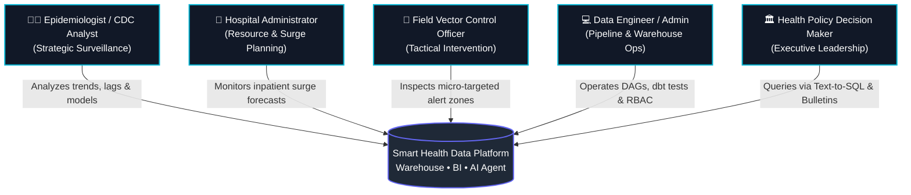
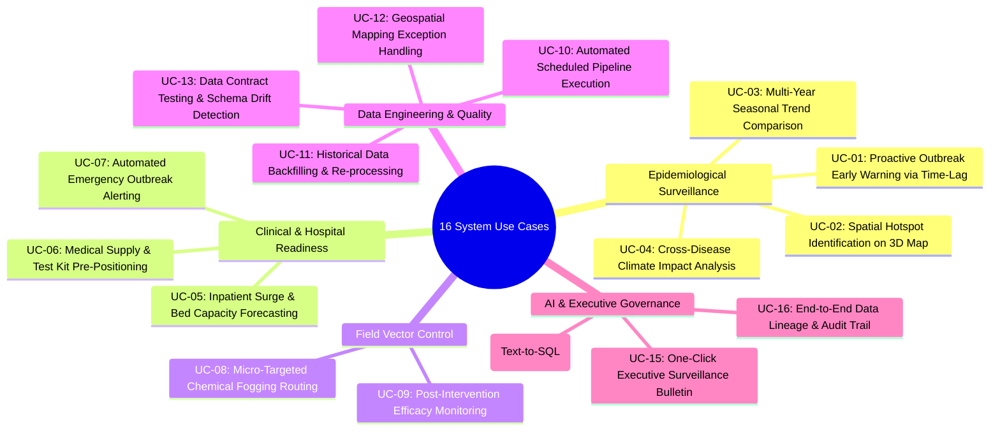

# COMPREHENSIVE SYSTEM ACTORS, USE CASES & FEATURE SPECIFICATIONS

> **Document Status:** Authoritative Functional Requirements Document (PRD)  
> **Target Audience:** Product Managers, Data Engineers, AI Architects, Epidemiologists, and Stakeholders  
> **Scope:** Smart Health Data Platform: Epidemic & Climate Surveillance System (16 Enterprise Use Cases)

---

## 1. SYSTEM ACTORS (USER PERSONAS)

| Actor | Persona Title | Primary Objectives | Key System Touchpoints |
| :--- | :--- | :--- | :--- |
| **Actor 1: Epidemiologist** | Public Health Surveillance Specialist (CDC) | Detect disease surges 2–4 weeks in advance; model vector biology dynamics; track multi-year transmission baselines. | 3D Choropleth Maps, Dual-Axis Time-Lag Charts, Historical Marts. |
| **Actor 2: Hospital Director** | Clinical Operations & Emergency Manager | Prevent hospital emergency room gridlock; anticipate inpatient bed demands, ICU needs, and IV fluid consumption. | Risk Stratification Matrix, Inpatient Projection Views. |
| **Actor 3: Field Vector Officer** | Municipal Pest & Vector Control Coordinator | Pinpoint specific high-risk districts (rainfall > 50mm, humidity > 80%) to direct targeted larvicide and chemical spraying. | High/Severe Alerting Feeds, District GIS Drill-down Maps. |
| **Actor 4: Data Engineer** | Platform Architect / Systems Admin | Maintain idempotent ETL/ELT pipelines, enforce data contracts, automate dbt testing, manage RBAC and Docker containers. | Mage.ai Orchestrator, PostgreSQL 16, dbt CLI / Lineage, Docker Compose. |
| **Actor 5: Policy Decision Maker**| Ministry / Health Department Executive | Understand macro epidemic trends; justify budget allocations; query operational data in real-time without writing SQL. | Executive KPI Summary Cards, Conversational AI Assistant (Text-to-SQL). |

---

## 2. FUNCTIONAL FEATURE MODULES

1. **Module 1: Automated Multi-Source Ingestion & Orchestration (Mage.ai):** Batch CSV ingestion, real-time Open-Meteo ERA5 & OpenAQ API polling, UN OCHA boundary parsing, audit logging (`_ingested_at`, `_source_file`).
2. **Module 2: Medallion Data Cleansing, Harmonization & Storage (Silver):** Deduplication, wide-to-long reshaping, P-Code geospatial harmonization, time-series missing data imputation (forward-fill/rolling average).
3. **Module 3: Advanced Feature Engineering & dbt Modeling (Gold):** Star Schema (`Dim_Date`, `Dim_Location`, `Fact_Disease_Climate_Weekly`), Incidence Rate per 100k, Time-Lag window functions (2W, 4W), automated dbt test suites.
4. **Module 4: Interactive Surveillance Dashboard & Spatial Analytics:** PyDeck 3D Extruded Choropleth Map, Plotly Dark Glass Dual-Axis Lag Charts, Multi-Tier Risk Matrix, Epi-week timeline slider.
5. **Module 5: Conversational AI Epidemiological Assistant (Text-to-SQL):** Natural language querying, 4-layer security sandbox, automated Plotly chart rendering, one-click executive surveillance bulletins.

---

## 3. MASTER USE CASE CATALOG (16 USE CASES)

---

### 🔹 DOMAIN A: EPIDEMIOLOGICAL SURVEILLANCE & ANALYTICS

#### UC-01: Proactive Outbreak Early Warning via Time-Lag Signal
* **Primary Actor:** Epidemiologist
* **Trigger:** Health analyst reviews upcoming weather forecasts and previous weeks' precipitation.
* **Workflow:**
  1. Actor opens the **Time-Lag Correlation** view on the dashboard.
  2. Actor inspects dual-axis charts plotting weekly rainfall against clinical dengue cases.
  3. System flags that cumulative precipitation exceeded 100mm during Week $W$.
  4. System projects that the biological incubation cycle (*Aedes* mosquito lifecycle of 7–10 days + viral replication of 8–12 days) will trigger a clinical surge at Week $W+2$ to $W+4$.
* **Value Delivered:** Shifts public health policy from passive emergency reaction to proactive vector suppression 14–28 days ahead of hospital surges.

#### UC-02: Spatial Hotspot Identification via 3D Extruded Choropleth Map
* **Primary Actor:** Epidemiologist / Field Coordinator
* **Trigger:** Epidemiologist investigates geographic concentration of recent infections.
* **Workflow:**
  1. Actor opens the **Epidemiological Choropleth Map**.
  2. Actor scrubs the **Epi-Week Slider** across recent time intervals.
  3. System renders 3D extruded polygons where column height corresponds to **Incidence Rate per 100,000 population** and color indicates risk category.
  4. Actor hovers over an extruded red polygon to inspect localized indicators (case count, population, rainfall lag, humidity).
* **Value Delivered:** Eliminates urban population bias, highlighting high-transmission rural districts that would otherwise remain masked.

#### UC-03: Multi-Year Seasonal Baseline Trend Comparison
* **Primary Actor:** Epidemiologist / CDC Analyst
* **Trigger:** Need to evaluate whether current infection rates exceed historical endemic thresholds.
* **Workflow:**
  1. Actor selects the **Seasonal Benchmarking** module.
  2. System overlays current year's Epi-week curves against the 3-year historical average (mean $\pm$ 2 standard deviations).
  3. System highlights when the current trajectory crosses the upper epidemic threshold envelope.
* **Value Delivered:** Authoritative statistical determination of whether an active outbreak constitutes an official public health epidemic.

#### UC-04: Cross-Disease Climate Impact Analysis
* **Primary Actor:** Epidemiologist / Environmental Health Researcher
* **Trigger:** Analyzing how distinct meteorological patterns drive divergent disease burdens.
* **Workflow:**
  1. Actor filters by disease types: Dengue (Vector-borne) vs Pneumonia/Asthma (Respiratory) vs Cholera (Water-borne).
  2. System cross-correlates high rainfall/humidity against dengue spikes versus high PM2.5/AQI against respiratory admissions.
* **Value Delivered:** Proves the differential impact of climate variables across diverse public health challenges on a single platform.

---

### 🔹 DOMAIN B: CLINICAL READINESS & HOSPITAL RESOURCE PLANNING

#### UC-05: Inpatient Surge & Bed Capacity Forecasting
* **Primary Actor:** Hospital Operations Director
* **Trigger:** Weekly departmental resource and staffing planning meeting.
* **Workflow:**
  1. Actor filters the dashboard by hospital catchment area (provinces/districts served).
  2. System retrieves projected case trends and applies historical hospitalization conversion rates (~25% of clinical cases requiring inpatient beds; ~5% requiring ICU).
  3. System displays estimated bed deficit/surplus projections for the upcoming 2 weeks.
  4. Actor reallocates general medical ward beds to pediatric and infectious disease units.
* **Value Delivered:** Prevents hospital overcrowding and ambulance diversion during epidemic peaks.

#### UC-06: Medical Supply & Diagnostic Inventory Pre-Positioning
* **Primary Actor:** Hospital Administrator / Procurement Officer
* **Trigger:** Local area classified into `High` or `Severe` risk tier.
* **Workflow:**
  1. System displays recommended inventory safety stocks based on forecasted case counts.
  2. Actor reviews inventory requirements: Dengue NS1 antigen test kits, platelet transfusion bags, IV fluid electrolytes (Ringer's Lactate).
  3. Procurement triggers pre-orders before regional supply chain shortages emerge.
* **Value Delivered:** Guarantees critical medicine availability during life-threatening hemorrhagic fever stages.

#### UC-07: Automated Emergency Outbreak Alerting
* **Primary Actor:** Public Health Official / Emergency Response Teams
* **Trigger:** An administrative unit's risk index transitions into the `Severe` (Red Alert) tier.
* **Workflow:**
  1. The dbt transformation pipeline completes scheduled execution and identifies multi-factor criteria breach.
  2. The system automatically dispatches an alert payload via Webhook / Telegram Bot / Email.
  3. The notification details: Province name, current Incidence Rate, 2-week lagged rainfall, and recommended immediate interventions.
* **Value Delivered:** Zero-latency alerting without requiring staff to manually log into dashboards.

---

### 🔹 DOMAIN C: TACTICAL FIELD OPERATIONS & VECTOR CONTROL

#### UC-08: Micro-Targeted Chemical Fogging & Larvicide Routing
* **Primary Actor:** Municipal Vector Control Officer
* **Trigger:** Planning weekly community sanitation and insecticide spraying operations.
* **Workflow:**
  1. Actor navigates to the **Tactical Action Matrix**.
  2. Actor filters for districts where rainfall 2 weeks prior exceeded 50mm and humidity remains > 75%.
  3. System outputs a prioritized geographic target list with centroid coordinates and boundary GeoJSON.
  4. Vector teams dispatch ultra-low volume (ULV) thermal fogging crews and distribute *Abate* larvicide to standing water containers in highlighted zones.
* **Value Delivered:** Optimizes municipal chemical budgets by targeting breeding habitats before adult mosquitoes disperse.

#### UC-09: Post-Intervention Efficacy Monitoring
* **Primary Actor:** Sanitation Officer / Epidemiologist
* **Trigger:** Two to three weeks following an intensive vector suppression campaign.
* **Workflow:**
  1. Actor tags the intervention date and target district in the system.
  2. System plots the subsequent epidemiological curve against expected transmission trajectories.
  3. System calculates the percentage reduction in new incident cases attributable to the intervention.
* **Value Delivered:** Provides measurable data proving the return on investment (ROI) of public health interventions.

---

### 🔹 DOMAIN D: DATA ENGINEERING, QUALITY & PIPELINE OPERATIONS

#### UC-10: Automated Scheduled Pipeline Execution & Health Heartbeat
* **Primary Actor:** Data Engineer / Platform Administrator
* **Trigger:** Scheduled cron trigger (e.g., Every Monday at `02:00 AM UTC`).
* **Workflow:**
  1. Mage.ai activates ingestion DAGs (Kaggle batch files, Open-Meteo ERA5 API).
  2. Raw data persists into `bronze` schema with `_ingested_at` audit columns.
  3. Transformations execute through `silver` to `gold` via `dbt run`.
  4. Orchestrator executes `dbt test` verifying referential integrity.
  5. System emits successful execution heartbeat to monitoring logs.
* **Value Delivered:** Unattended, reliable pipeline operations running on a predictable cadence.

#### UC-11: Historical Data Backfilling & Idempotent Reprocessing
* **Primary Actor:** Data Engineer
* **Trigger:** Upgrading feature engineering logic (e.g., adding a new 6-week lag variable) or onboarding 5 years of historical archives.
* **Workflow:**
  1. Actor triggers pipeline with parameter `--backfill --start-date 2020-01-01 --end-date 2025-01-01`.
  2. Ingestion and transformation logic runs idempotently, replacing or upserting records using primary surrogate keys.
  3. Database row counts match expected dates without generating duplicate records.
* **Value Delivered:** Effortless model iteration and historical recalculation without data corruption.

#### UC-12: Geospatial Mapping Exception Handling & Orphan Entity Resolution
* **Primary Actor:** Data Engineer
* **Trigger:** Incoming raw health report contains an unmapped or misspelled provincial name.
* **Workflow:**
  1. The Silver layer harmonization pipeline attempts fuzzy matching against UN OCHA P-Codes.
  2. If confidence falls below 85%, the record is routed to `silver.unresolved_spatial_exceptions`.
  3. Data Engineer inspects exceptions and adds manual alias mappings to `Dim_Location`.
  4. Pipeline re-processes staged records cleanly into the Gold Mart.
* **Value Delivered:** Guarantees 100% referential integrity without silent data loss.

#### UC-13: Automated Data Contract Testing & Schema Drift Detection
* **Primary Actor:** Data Engineer
* **Trigger:** Upstream data source updates its API schema or CSV headers unexpectedly.
* **Workflow:**
  1. Staging pipeline validates landed files against contracts defined in `DATA_CONTRACTS.md`.
  2. If a column type mismatch or unexpected nullability occurs, `dbt test` halts downstream builds.
  3. System logs detailed contract violation errors (`Expected NUMERIC for rainfall_mm, received VARCHAR`).
* **Value Delivered:** Protects the Gold analytical mart and dashboards from corrupted data.

---

### 🔹 DOMAIN E: CONVERSATIONAL AI & EXECUTIVE GOVERNANCE

#### UC-14: Ad-Hoc Natural Language Querying via Sandboxed Text-to-SQL
* **Primary Actor:** Health Policy Decision Maker / Clinical Analyst
* **Trigger:** Decision maker needs an immediate analytical answer to a non-standard business question.
* **Workflow:**
  1. Actor opens the conversational chat tab and types: *"What were the top 3 provinces with highest dengue incidence rate in September 2024?"*.
  2. LLM receives query grounded with Gold layer schema definitions.
  3. System generates sandboxed SQL, executes syntax blacklist checks, enforces `BEGIN READ ONLY;`, and bounds execution with a 3000ms timeout.
  4. System formats result into an explanatory summary, data table, and interactive Plotly chart.
* **Value Delivered:** Democratizes data access, enabling non-technical stakeholders to query complex data warehouses instantly.

#### UC-15: One-Click Executive Surveillance Bulletin Generation
* **Primary Actor:** Ministry Public Relations / Health Department Executive
* **Trigger:** Preparation for weekly national cabinet or press briefings.
* **Workflow:**
  1. Actor clicks **"Generate Weekly Bulletin"** on the dashboard.
  2. System aggregates national KPIs: Total active cases, week-over-week percentage change, top 5 hotspot districts, climate summary.
  3. System generates a clean, exportable visual report ready for media and executive distribution.
* **Value Delivered:** Saves hours of manual slide deck creation every week.

#### UC-16: End-to-End Data Lineage Auditing & Compliance Tracking
* **Primary Actor:** Data Architect / Academic Evaluation Committee
* **Trigger:** Regulatory compliance review or capstone thesis defense.
* **Workflow:**
  1. User navigates to the compiled `dbt docs` interactive lineage graph.
  2. User inspects any metric (e.g., `rainfall_lag_2w` in `Fact_Disease_Climate_Weekly`).
  3. Graph visually traces lineage backwards: Open-Meteo ERA5 API $\to$ `bronze.raw_weather` $\to$ `silver.stg_climate` $\to$ `gold.fact_disease_climate_weekly`.
  4. User views column descriptions, SQL transformation code, and test coverage logs.
* **Value Delivered:** 100% transparency, auditability, and academic defensibility.
